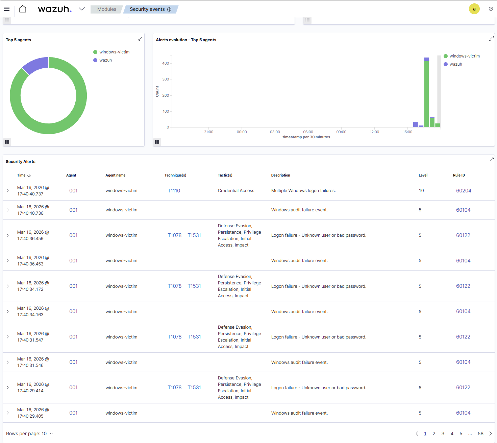
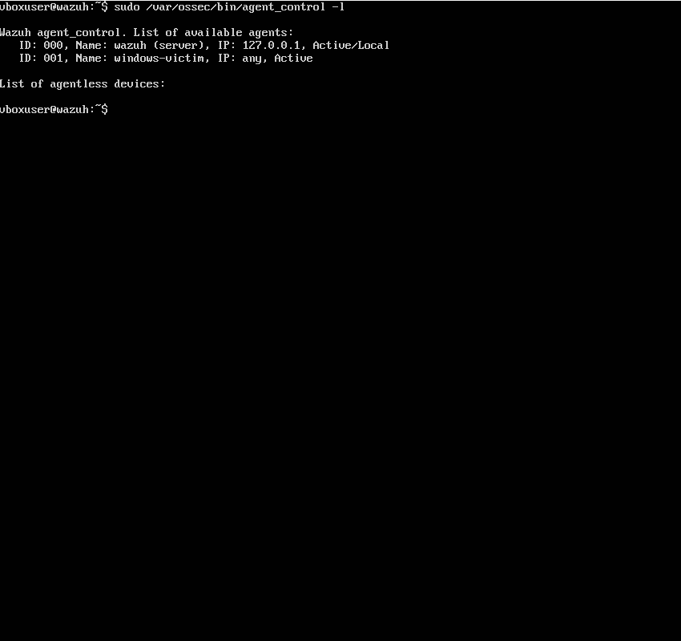
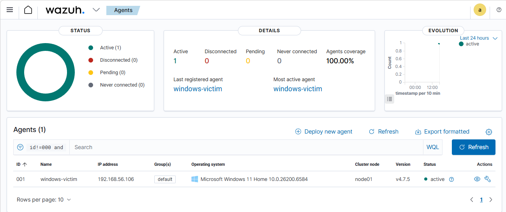
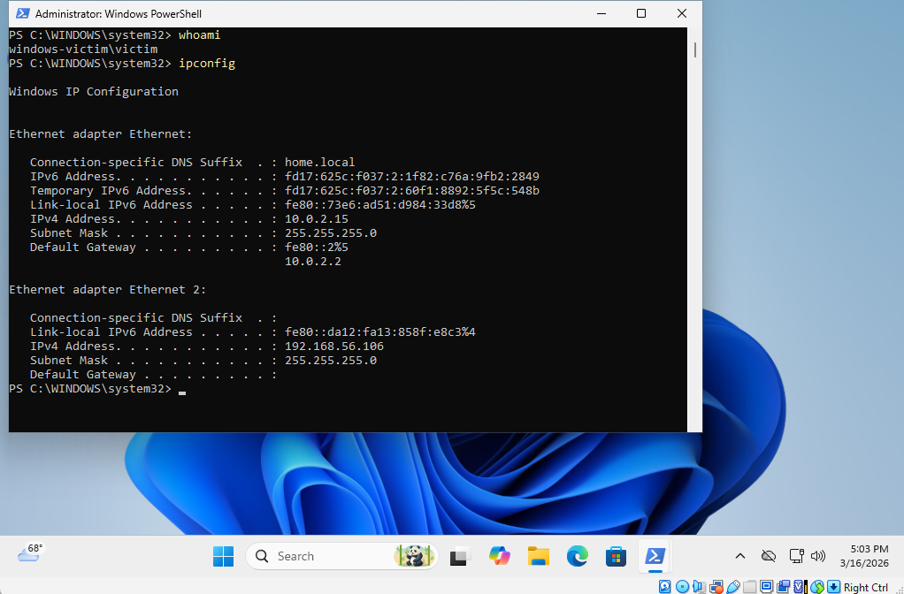

# wazuh-windows-failed-logon-detection-lab
SIEM lab using Wazuh to detect failed Windows logon attempts with agent enrollment and alert validation.
# Wazuh Windows Failed Logon Detection Lab

## Objective
Build a basic SIEM detection lab using Wazuh and a Windows 11 endpoint to detect failed logon attempts and validate agent-to-server communication.

## Lab Overview
This lab demonstrates how Wazuh can collect Windows security events from an enrolled endpoint and generate alerts for failed authentication attempts.

## Tools Used
- Wazuh SIEM
- Windows 11 VM
- Linux Wazuh server
- PowerShell
- VirtualBox / Host-only networking

## Detection Use Case
Detect repeated Windows logon failures on a monitored endpoint.

## Environment
### Wazuh Server
- Host: Ubuntu/Linux-based Wazuh server
- Function: SIEM manager

### Endpoint
- Hostname: windows-victim
- OS: Windows 11 Home
- Wazuh Agent Version: 4.7.5
- IP Address: 192.168.56.106

## Steps Performed
1. Installed and configured Wazuh server.
2. Installed Wazuh agent on Windows 11 endpoint.
3. Verified the endpoint was enrolled and active in the Wazuh dashboard.
4. Confirmed agent connectivity from the Wazuh server using `agent_control -l`.
5. Generated failed Windows logon attempts on the Windows endpoint.
6. Observed security alerts populate in the Wazuh dashboard.

## Detection Results
Wazuh successfully detected failed Windows authentication attempts and generated alerts including:
- Multiple Windows logon failures
- Windows audit failure events
- Logon failure due to unknown user or bad password

## Alert Details
### Example Wazuh Alerts Observed
- Rule ID: 60204  
  - Description: Multiple Windows logon failures  
  - Level: 10  
  - MITRE Technique: T1110  
  - Tactic: Credential Access

- Rule ID: 60104  
  - Description: Windows audit failure event  
  - Level: 5

- Rule ID: 60122  
  - Description: Logon failure - Unknown user or bad password  
  - Level: 5  
  - MITRE Techniques: T1078, T1531

## Screenshots

### 1. Wazuh Security Events Dashboard
Shows Wazuh detecting failed logon events from the Windows endpoint.

### 2. Wazuh Server Agent Verification
Shows the Wazuh server listing the registered Windows endpoint as active.

### 3. Wazuh Agent Dashboard
Shows the Windows agent registered, active, and reporting its IP address.

### 4. Windows Victim Host Verification
Shows the Windows endpoint identity and IP configuration.

## Skills Demonstrated
- SIEM setup and validation
- Endpoint agent enrollment
- Windows event monitoring
- Authentication failure detection
- Basic alert triage
- MITRE ATT&CK mapping awareness

## Lessons Learned
- Proper network connectivity between the Wazuh server and Windows endpoint is required for agent communication.
- Failed logon activity is quickly visible in Wazuh once the Windows agent is properly configured.
- Wazuh provides useful context such as severity, rule ID, and MITRE ATT&CK mapping for security events.

## Future Improvements
- Add brute-force simulation from a separate attacker VM
- Create custom Wazuh rules
- Forward logs to another analytics platform
- Expand the lab to include Sysmon for deeper visibility

## Author
Johnathan Preciado
